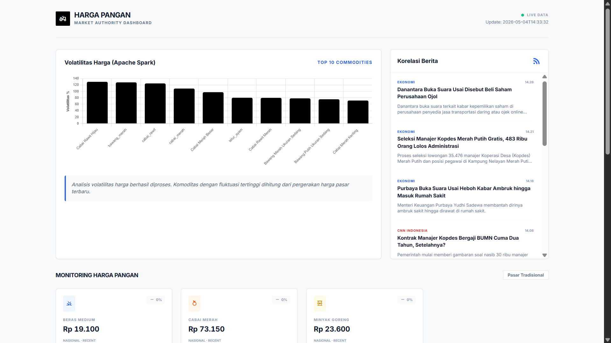
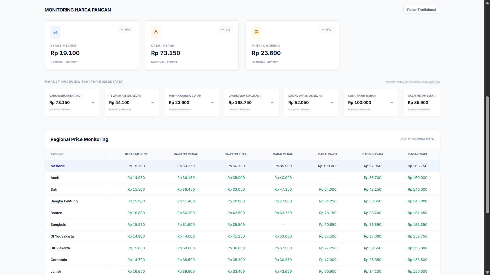

# ETS BigData (C) Kelompok 4 - HargaPangan

## Anggota Kelompok
| Anggota                        | NRP        | Kontribusi & Tanggung Jawab                                                                                                                                                      |
| ------------------------------ | ---------- | -------------------------------------------------------------------------------------------------------------------------------------------------------------------------------- |
| Maritza Adelia Sucipto         | 5027241111 | Setup Infrastruktur: Docker (Hadoop/HDFS & Kafka), konfigurasi network/port, troubleshooting awal.                                                                              |
| Adinda Cahya Pramesti          | 5027241117 | Data Ingestion (API): `producer_api.py` untuk mengambil data harga komoditas dan mengirim ke Kafka topic `pangan-api`.                                                         |
| Alnico Virendra Kitaro Diaz    | 5027241081 | Data Ingestion (RSS): `producer_rss.py` untuk berita ekonomi dan `consumer_to_hdfs_updated.py` untuk sinkronisasi data dari Kafka ke HDFS.                                     |
| Afriza Tristan Calendra Rajasa | 5027241104 | Data Processing: `spark/analysis.ipynb` untuk analisis volatilitas, tren harga, dan korelasi berita menggunakan Spark.                                                          |
| Ahmad Yafi Ar Rizq             | 5027241066 | Dashboard & Visualization: Flask app untuk menampilkan hasil analisis Spark, harga live, dan berita ekonomi secara real-time.                                                  |

---

## Deskripsi Proyek
**HargaPangan** adalah sistem monitoring harga komoditas bahan pokok secara real-time. Sistem ini dirancang untuk tim riset (seperti Bulog) sebagai alat bantu *early warning* dalam memantau fluktuasi harga bahan pokok dan menghubungkannya dengan berita ekonomi terkini.

### Justifikasi Pemilihan Topik
Topik ini dipilih karena harga bahan pokok memiliki dampak langsung terhadap stabilitas ekonomi masyarakat. Dengan menggabungkan data harga (kuantitatif) dan berita ekonomi (kualitatif), sistem ini dapat memberikan wawasan lebih mendalam tentang *mengapa* harga suatu komoditas bergejolak, bukan sekadar *apa* yang berubah.

### Pertanyaan Bisnis Utama
> "Komoditas mana yang paling bergejolak harganya hari ini, dan apakah ada berita ekonomi yang menjelaskan penyebabnya?"

---

## Arsitektur Sistem
Sistem ini menggunakan stack Big Data modern untuk menangani aliran data dari ingestion hingga visualisasi.


---

## Cara Menjalankan Sistem

### 1. Prasyarat
- Docker & Docker Compose
- Python 3.x
- Library Python: `kafka-python`, `feedparser`, `requests`, `flask`, `pyspark`

### 2. Environment Setup (Sekali saja)

a. Setup Python Virtual Environment:
```bash
python -m venv .venv
# Windows
.venv\Scripts\activate
# macOS / Linux
source .venv/bin/activate
```

b. Install dependencies:
```bash
pip install -r requirements.txt
```

### 3. Setup Infrastruktur Docker (Hadoop & Kafka)
Jalankan kontainer Docker untuk Hadoop dan Kafka:
```bash
docker-compose -f docker-compose-hadoop.yml up -d
docker-compose -f docker-compose-kafka.yml up -d
```

Verifikasi containers sudah running:
```bash
docker ps
```

### 4. Inisialisasi Kafka Topics & HDFS Directories (Sekali saja)

Setelah kontainer jalan, jalankan perintah ini untuk membuat topic dan folder:
```bash
# Membuat Kafka Topics (gunakan --if-not-exists untuk safety)
docker exec -it kafka kafka-topics --create --if-not-exists --topic pangan-api --bootstrap-server localhost:9092 --partitions 1 --replication-factor 1
docker exec -it kafka kafka-topics --create --if-not-exists --topic pangan-rss --bootstrap-server localhost:9092 --partitions 1 --replication-factor 1

# Membuat Folder HDFS
docker exec -it namenode hdfs dfs -mkdir -p /data/pangan/api
docker exec -it namenode hdfs dfs -mkdir -p /data/pangan/rss
docker exec -it namenode hdfs dfs -mkdir -p /data/pangan/checkpoints
```

Untuk detail lebih teknis mengenai infrastruktur, silakan cek [INFRASTRUCTURE.md](./INFRASTRUCTURE.md).

### 5. Generate Initial Spark Analysis

Jalankan analisis Spark lightweight untuk generate file hasil awal:
```bash
python spark/run_analysis_simple.py
```

### 6. Menjalankan Semua Layanan

#### Option A: Menggunakan Orchestrator (Recommended)
Jalankan semua komponen sekaligus dengan satu command:
```bash
python orchestrator.py
```

Ini akan secara otomatis memulai:
- API Producer (fetch harga komoditas dari BI)
- RSS Producer (fetch berita ekonomi)
- HDFS Consumer (tulis data ke HDFS + sinkronisasi dashboard)
- Spark Scheduler (analisis setiap 10 menit)
- Flask Dashboard (UI real-time)

Tekan `Ctrl+C` untuk menghentikan semua layanan.

#### Option B: Menjalankan Terpisah (buka terminal terpisah untuk masing-masing)

**Terminal 1 - Kafka Consumer (sinkronisasi ke HDFS & dashboard):**
```bash
python kafka/consumer_to_hdfs_updated.py
```

**Terminal 2 - Kafka Producer API (harga komoditas dari BI):**
```bash
python kafka/producer_api.py
```

**Terminal 3 - Kafka Producer RSS (berita ekonomi):**
```bash
python kafka/producer_rss.py
```

**Terminal 4 - Spark Scheduler (analisis otomatis setiap 10 menit):**
```bash
python spark/spark_scheduler.py
```

**Terminal 5 - Flask Dashboard (UI real-time):**
```bash
python dashboard/app.py
```

### 7. Akses Dashboard

Buka browser dan navigasi ke:
```bash
http://127.0.0.1:5000
```

---

## Screenshots
*(Akan ditambahkan setelah sistem berjalan sepenuhnya)*
- **HDFS Web UI**: 

- **Kafka Consumer Output**: Log terminal dari consumer.
- **Dashboard**: Tampilan visualisasi web.




---

## Tantangan & Solusi
*(Akan diperbarui selama proses pengerjaan)*

---

## Troubleshooting

**Dashboard tidak menampilkan data:**
- Pastikan consumer berjalan dan logs menunjukkan data masuk
- Cek file `dashboard/data/live_api.json` ada
- Refresh browser (Ctrl+F5)

**Kafka Connection Refused:**
- Pastikan Kafka container running: `docker ps | grep kafka`
- Restart Kafka: `docker-compose -f docker-compose-kafka.yml restart`

**HDFS Web UI untuk monitoring:**
- Akses di: `http://localhost:19870`

**Performa Lambat:**
- Producer API menunggu response dari BI (normal ~40 detik per cycle)
- RSS parsing dapat tahan hingga 20+ detik per feed
- Kurangi jumlah terminal yang berjalan jika memory terbatas

---

## Fitur HDFS Storage & Spark Scheduler

### HDFS Data Storage
Data dari API dan RSS secara otomatis disimpan di HDFS dengan struktur:
```
/data/pangan/api/          ← JSON files dari price API (dibuffer per 100 records)
/data/pangan/rss/          ← JSON files dari RSS feeds (dibuffer per 100 records)
/data/pangan/checkpoints/  ← Checkpoint untuk fault tolerance
```

**Monitoring HDFS:**
```bash
# Lihat isi HDFS
docker exec -it namenode hdfs dfs -ls -R /data/pangan/

# Lihat jumlah files per direktori
docker exec -it namenode hdfs dfs -count /data/pangan/api/
docker exec -it namenode hdfs dfs -count /data/pangan/rss/

# Akses Web UI
# Buka: http://localhost:19870
```

### Spark Scheduler (Automatic Analysis)
Spark secara otomatis menjalankan analisis **setiap 10 menit** dan menghasilkan:
- **Volatilitas Komoditas**: Top 10 komoditas dengan fluktuasi harga terbesar
- **Tren Harga**: Perubahan harga per jam untuk setiap komoditas
- **Harga Terkini**: Harga terbaru untuk semua komoditas
- **Berita Relevan**: Top 10 berita ekonomi terkini

Output disimpan ke: `dashboard/data/spark_results.json`

**Monitoring Spark Jobs:**
```bash
# Lihat log Spark scheduler
# (Output akan terlihat di terminal saat menjalankan spark/spark_scheduler.py)

# Check hasil analisis terbaru
cat dashboard/data/spark_results.json | python -m json.tool
```

---

## Struktur Repository
```
.
├── orchestrator.py              ← Master service orchestrator (jalankan ini!)
├── docker-compose-hadoop.yml    ← Konfigurasi HDFS
├── docker-compose-kafka.yml     ← Konfigurasi Kafka
├── kafka/                       ← Layer Ingestion
│   ├── producer_api.py
│   ├── producer_rss.py
│   └── consumer_to_hdfs_updated.py  ← HDFS-enabled consumer (baru!)
├── spark/                       ← Layer Processing
│   ├── analysis.ipynb
│   ├── run_analysis_simple.py
│   └── spark_scheduler.py       ← Automatic scheduler every 10 mins (baru!)
├── dashboard/                   ← Layer Visualisasi
│   ├── app.py
│   └── templates/index.html
└── data/                        ← Data Lake (local staging)
    └── pangan/
        ├── api/                 ← Data API yang sudah masuk HDFS local mirror
        ├── api_staging/         ← Temp API data sebelum upload HDFS
        ├── hasil/               ← Output analisis Spark
        ├── rss/                 ← Data RSS yang sudah masuk HDFS local mirror
        └── rss_staging/         ← Temp RSS data sebelum upload HDFS
```
